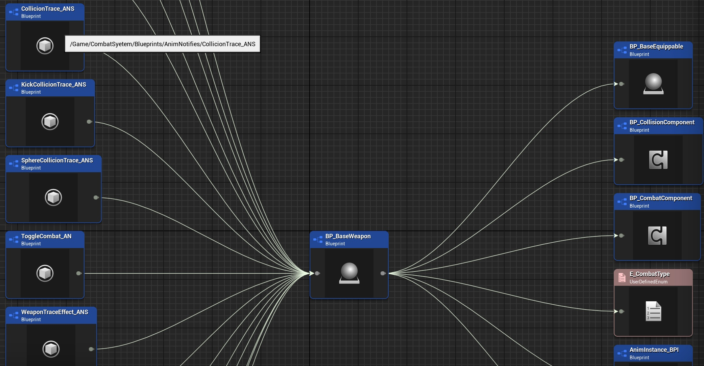
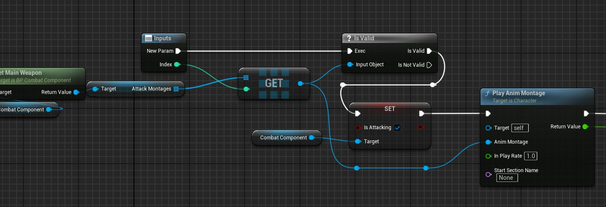
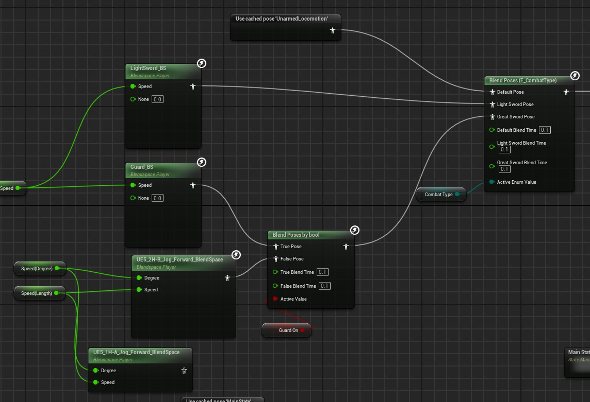
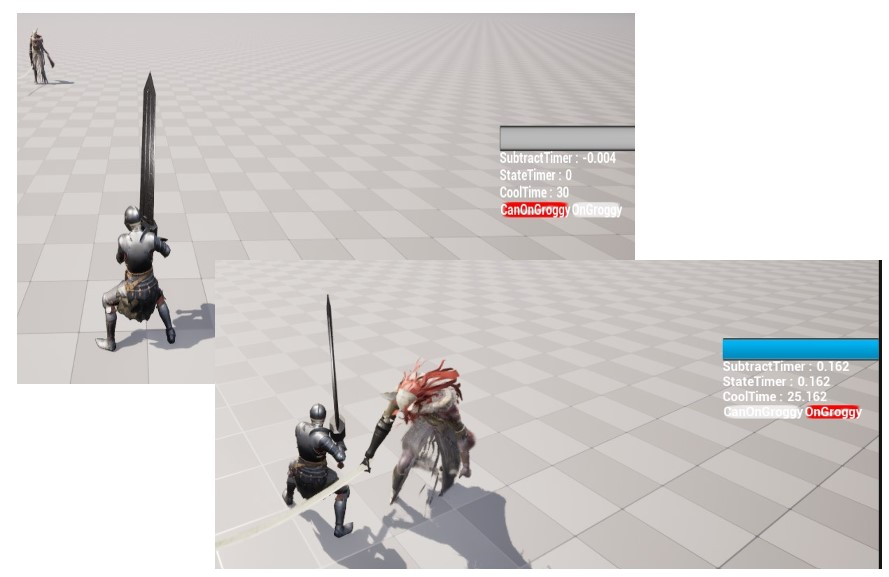
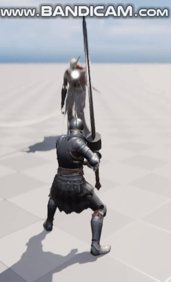

# Second Project EromSoft

   
  
   

목차

1. 프로젝트 개요
2. 진행한 작업
3. 느낀점 및 아쉬웠던점

## 1. 프로젝트 소개

<table>
  <tr>
    <td style="width: 30%; vertical-align: top;">
      
    </td>
    <td style="width: 70%; vertical-align: top; text-align: left;">
      <h3>프로젝트 개요/동기</h3>
      <ul>
        <li>6주간 3인으로 진행한 게임 프로젝트</li>
		<li>엘든링의 말레니아전을 레퍼런스로 모작 진행</li>
		<li>다양한 캐릭터의 필요로 인해 중복적인 기능처리가 이루어지는 부분들을 상속관계로 묶는 작업과 전투 시스템을 중점으로 작업 진행</li>
      </ul>
    </td>
  </tr>
</table>

## 기술 스택

|	GitHub	|UnrealEngine|	Blender		|
| :------: 	| 	:------: |	:------: 	|
| ![github]	| 	![ue]	 |		![bd]	|

 

## 2. 진행한 작업

주로 시스템 기능위주로 작업 진행

에너미 캐릭터를 위해 준비된 애니메이션에 맞게 리깅

블루프린트로 작성한 프로젝트 C++로 번역 시도

기능과 UI 연동 작업

소소한 블렌더 작업

프로젝트 깃 관리 시도

디버깅 작업

학원 내 타 프로젝트 팀 디버그 지원

### 2-1. Weapon 상위클래스
<table>
  <tr>
    <td style="width: 30%; vertical-align: top;">
      
    </td>
    <td style="width: 70%; vertical-align: top; text-align: left;">
      <ul>
        <li>여러 무기 사용을 염두에 둔 기본기능을 가진 상위클래스</li>
      </ul>
    </td>
  </tr>
</table>

### 2-2. 공격 애니메이션 재생 기능
<table>
  <tr>
    <td style="width: 30%; vertical-align: top;">
      
    </td>
    <td style="width: 70%; vertical-align: top; text-align: left;">
      <ul>
        <li>자주 사용하는 기능을 하나로 사용하기위해 작업</li>
		<li>무기에 맞는 애니메이션들을 무기 자체에 넣어놓고 인덱스만 넘겨주면 해당 애니메이션이 나오게 작업</li>
      </ul>
    </td>
  </tr>
</table>

### 2-3. AnimGraph
<table>
  <tr>
    <td style="width: 30%; vertical-align: top;">
      
    </td>
    <td style="width: 70%; vertical-align: top; text-align: left;">
      <ul>
        <li>한손 무기, 양손무기 및 무기에 따른 가드상태에서의 움직임을 다르게 처리하기 위해 Blend처리 진행</li>
      </ul>
    </td>
  </tr>
</table>

### 2-4. 테스트시의 디버깅UI작성
<table>
  <tr>
    <td style="width: 30%; vertical-align: top;">
      
    </td>
    <td style="width: 70%; vertical-align: top; text-align: left;">
      <ul>
        <li>조건이 까다롭게 섞여있어 해당 기능에 대해 연계된 기능을 작업한 다른 작업자의 테스트를 위해 디버그창을 작업해놓은 화면</li>
      </ul>
    </td>
  </tr>
</table>

### 2-5. LockOn기능
<table>
  <tr>
    <td style="width: 30%; vertical-align: top;">
      
    </td>
    <td style="width: 70%; vertical-align: top; text-align: left;">
      <ul>
        <li>소울류의 대표적 편의기능중 하나인 LockOn기능</li>
		<li>Target이 되는 Actor에게 시점을 고정 후 Pitch를 마우스 입력값으로 처리</li>
      </ul>
    </td>
  </tr>
</table>

### 2-6. C++ 번역 및 리펙토링(실패)
<table>
  <tr>
    <td style="width: 30%; vertical-align: top;">
      
    </td>
    <td style="width: 70%; vertical-align: top; text-align: left;">
      <ul>
        <li>블루프린트로 작업중이던 프로젝트 중 세팅관련을 제외한 나머지를 C++로 번역시도</li>
		<li>70%가량 작업완료 및 테스트가 되었으나 마지막 시연 준비기간 동안 마무리를 하지 못해 이후 프로젝트에서 사용</li>
		<li>가장 큰 목적은 급하게 작업하는 와중 캐릭터부분이 부모클래스 없이 각각 따로 작업이 되어버려서 상속관계 부여를 위한 리펙토링 및 관련 기능들의 단일화를 위함</li>
      </ul>
    </td>
  </tr>
</table>

### 2-7. Git관리(실패)
<table>
  <tr>
    <td style="width: 30%; vertical-align: top;">
      
    </td>
    <td style="width: 70%; vertical-align: top; text-align: left;">
      <ul>
        <li>작업중 쏟아져 들어온 에셋들과 자유분방한 파일관리로 인해 프로젝트의 Git관리가 어려움이 생겨 Git을 드랍하게 됨...</li>
		<li>게임 개발에서 디렉토리 관리의 중요성을 크게 느낀 프로젝트</li>
      </ul>
    </td>
  </tr>
</table>

 

## 3. 느낀점

- 아직 C++을 어려워하는 팀원들에게 예제 프로젝트를 하나 완성해주고 싶었으나 결국 번역을 마무리하지 못하여 다음 프로젝트에서 사용을 하게 된 점

- Git관리를 하기 위한 기본 룰 전달이 미흡했던 점

- 블루프린트를 통한 협업이 초반에 상당히 어려웠지만 프로젝트 중반 이후 차근차근 익숙해지며 수월해졌음

- 맡은 역할 중 가장 큰 시간이 소요된 작업이 드랍됨으로 인해 팀에 좀 미안한 프로젝트였음

- 아트적인 작업이 필요한 경우 소소한 블렌더 작업을 해보았으나 역시 아트는 어렵다는것을 느낌

- 엔진이 자체적으로 갖고있는 최적화 옵션들만 잘 활용해도 훨씬 리소스 사용량이 널널해지는것을 알게된 프로젝트

 

## 라이센스

MIT &copy; [NoHack](mailto:lbjp114@gmail.com)

<!-- Stack Icon Refernces -->

[git]: /images/stack/Git.svg
[github]: /images/stack/GithubDesktop.svg
[ue]: /images/stack/UnrealEngine.svg
[bd]: /images/stack/Blender.svg
