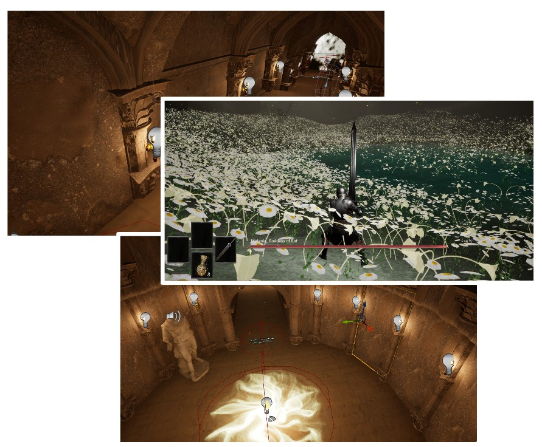

# 프로젝트 이름

   
  
   

목차

1. 프로젝트 개요
2. 진행한 작업
3. 느낀점

## 1. 프로젝트 소개

<table>
  <tr>
    <td style="width: 30%; vertical-align: top;">
      
    </td>
    <td style="width: 70%; vertical-align: top; text-align: left;">
      <h3>프로젝트 개요/동기</h3>
      <ul>
        <li></li>
      </ul>
    </td>
  </tr>
</table>

## 기술 스택

|	GitHub	|UnrealEngine|	Blender		|
| :------: 	| 	:------: |	:------: 	|
| ![github]	| 	![ue]	 |		![bd]	|

 

## 2. 진행한 작업

### 2-1. 금고 에셋 및 기능 제작
<table>
  <tr>
    <td style="width: 30%; vertical-align: top;">
      
    </td>
    <td style="width: 70%; vertical-align: top; text-align: left;">
      <ul>
        <li></li>
      </ul>
    </td>
  </tr>
</table>

### 2-5. 깃 관리
<table>
  <tr>
    <td style="width: 30%; vertical-align: top;">
      
    </td>
    <td style="width: 70%; vertical-align: top; text-align: left;">
      <ul>
        <li>선호하는 깃 관리방식인 Release/Work(최신)/Worker1/Worker2....방식으로 관리를 하려 하였으나 프로젝트 종료시점에는 결국 깃 적용이 안된상태로 완료가 됨</li>
      </ul>
    </td>
  </tr>
</table>

 

## 3. 느낀점

 

## 라이센스

MIT &copy; [NoHack](mailto:lbjp114@gmail.com)

<!-- Stack Icon Refernces -->

[git]: /images/stack/Git.svg
[github]: /images/stack/GithubDesktop.svg
[ue]: /images/stack/UnrealEngine.svg
[bd]: /images/stack/Blender.svg
